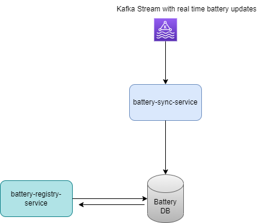

# This was implemented as part of the coding challenge 

# Assumptions
1. Battery name and post code  is a unique value.
2. Once the batteries are registered battery information/updates are available via a stream (selected Kafka)

# Archived Goals
1. Core requirement of implementing REST API in Spring Boot with given endpoints to register batteries + query batteries
2. Ensured the system can handle a large number of battery registrations concurrently with Spring JPA transactions + validations such as unique key constraints
3. Extended the postcode range query to allow filtering based on minimum or maximum watt capacity.
4. Introduced an endpoint to identify batteries below a certain capacity threshold.
5. Integrated a logging framework and logs were added appropriately in the service along with the Correlation-Id.
6. Endpoint was configured for health checks and metrics.
7. Unit testing was added 
8. Swagger3 is integrated for API documentation. 
9. Ensured backward compatibility for the API and provided versioning
10. Containerize the application using Docker (Used for local set up)

# Suggestions were documented for 

* They Architecture for introduce a real-time data stream (e.g., using Kafka or RabbitMQ) that sends updates on battery capacities.
* Database selection for storing data
* Resilience4j for rate limiting

# High level Architecture



### Battery-Registry-Service

See this page : [Documentation](battery-registry-service/README.md)

### Battery-Sync-Service

*** NOT IMPLEMENTED ***

This is a service which connects to a Kafka stream which have real time battery updates. This will be responsible for act as a processor which update database based on the messages. 

Having this as a separate service will be beneficial because it will not put load on battery-registry-service which has interface for querying data 

### Database

Given the concurrent environment of the application(battery registration and update with data streaming), Prefer to go with Relational database like PostgreSQL.
Test Application was developed with H2 in memory DB.

- DB Config
  - username and password are hardcoded since this is a testing application. Strictly avoiding these with live application.Environment variable will be used to pass values 
- Database Schema
  ```
    CREATE TABLE battery (
    id INT NOT NULL,
    name VARCHAR(50) NOT NULL,
    post_code VARCHAR(20) NOT NULL,
    watt_capacity INTEGER NOT NULL,
    created_at DATE NOT NULL,
    modified_at DATE,
    PRIMARY KEY (id),
    UNIQUE KEY unique_key_battery_name_post_code (name, post_code)
    );
  ```

- Indexes
    - Index on "post_code" : Proposing this as battery information is queries based on the post code 
    - Index on watt_capacity : Proposing this as battery information is queries based on the watt capacity


